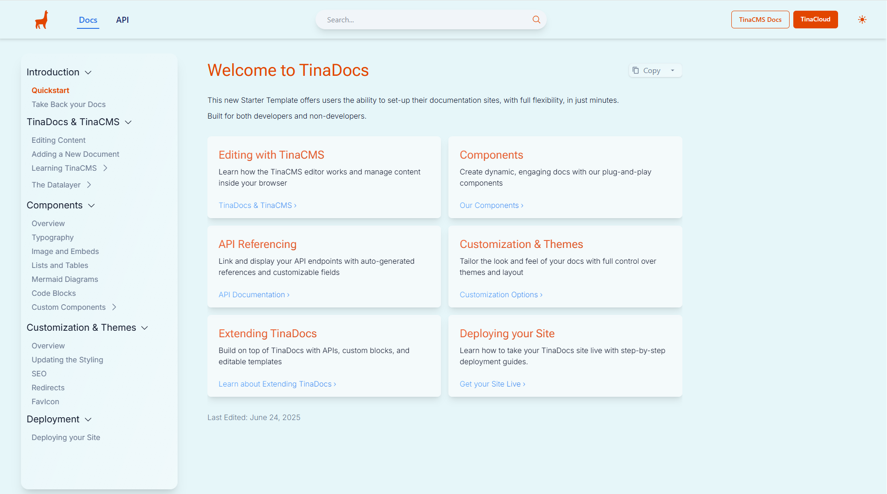

# 🚀 TinaDocs - Your Complete Documentation Solution

> **Modern documentation made simple and powerful**

TinaDocs is a complete documentation solution built with [Tina CMS](https://tina.io/) that combines developer-friendly tools with content creator accessibility.


**Figure: Landing Page of TinaDocs**

## ✨ Why Choose TinaDocs

### **Rich Feature Set**
- **🔍 Fast search** - Powered by Pagefind for instant content discovery
- **📊 API documentation** - Generate beautiful API docs from your OpenAPI specs
- **📑 Multi-tab interfaces** - Organize complex information with tabbed layouts
- **🎨 Custom theming** - Make your docs match your brand
- **✏️ Visual editing** - Content creators can edit directly through TinaCMS
- **📱 Responsive design** - Works great on all devices
- **⚡ Performance optimized** - Built with Next.js for fast load times

### **What Makes It Special**
- **Modern stack** - Clean, maintainable codebase
- **Developer-friendly** - Easy to customize and extend
- **Content creator-friendly** - Non-technical team members can contribute
- **SEO optimized** - Built-in best practices for search visibility

---

## 🚀 Quick Start with npx

The fastest way to get started with TinaDocs is using npx:

```bash
npx {{ TODO }} my-docs --template tinadocs
```

This command will:
- Download and set up TinaDocs in a new directory called `my-docs`
- Prompt you to select your preferred theme during setup
- Configure the basic project structure
- Install all necessary dependencies

### **Available Themes**

When using npx, you can choose from these beautiful themes:

- **Default** - Clean black and white design
- **Tina** - TinaCMS-inspired theme with orange accents
- **Blossom** - Elegant pink/rose color scheme
- **Lake** - Professional blue color palette
- **Pine** - Natural green tones
- **Indigo** - Modern purple/indigo design

---

## 📖 How to Use TinaDocs

There are two ways you can use TinaDocs:

• **For developers** – as a launching point to develops a highly custom docs solution. TinaCMS is based on markdown. Use this code as a basis to [implement custom components](https://tina.io/docs/reference/types/rendering-markdown#linking-to-react-components) to be used in MDX to fit your use case. Follow the Getting Started guide below.

• **Quickest experience** – use as is and deploy in minutes via TinaCloud for a docs setup that you still hold all the keys and data for, and get to using right away.


> 💡 TinaCMS integrates tighly with GitHub, and has a powerful [editorial workflow](https://tina.io/docs/tina-cloud/editorial-workflow) based on GitHub's branch protection features.

## 🛠️ Getting Started

### **Step 1: Install Dependencies**

> 💡 We recommend `pnpm` for faster installs. [Learn why pnpm is great](https://www.ssw.com.au/rules/best-package-manager-for-node/) for Node.js projects.

```bash
pnpm install
```

### **Step 2: Start Development Server**

```bash
pnpm dev
```

Open [http://localhost:3000](http://localhost:3000) to see your docs in action.

---

## 🌐 Production Setup

### **Step 3: Set Up GitHub and TinaCloud**

1. **Add your docs to GitHub**: Push your local repository to GitHub if you haven't already
2. **Create a TinaCloud account**: Sign up at [app.tina.io](https://app.tina.io)
3. **Link your repository**: Connect your GitHub repository to TinaCloud through the dashboard
Note: if you don’t see your repo in the list, click the button “Configure your TinaCloud permissions on GitHub” at the bottom of the page

### **Step 4: Configure Environment**

1. Rename `.env.example` to `.env`
2. Add your Tina credentials:

```env
NEXT_PUBLIC_TINA_CLIENT_ID=<get this from app.tina.io>
TINA_TOKEN=<get this from app.tina.io>
NEXT_PUBLIC_TINA_BRANCH=<your content branch>
NEXT_PUBLIC_ENABLE_THEME_SELECTION=<dispaly theme selector>
```

**Theme Preview Mode:**
To enable a theme selector in the UI for previewing all themes, add:
```env
NEXT_PUBLIC_ENABLE_THEME_SELECTION=true
```

> 💡 **Note:** The theme selector allows you to preview different themes in real-time, but these changes are temporary and won't persist when you open a new browser window/tab. To make a theme permanent, update the `Selected Them` field in your Settings through TinaCMS.

### **Step 5: Build for Production**

```bash
pnpm build
```

---

## 🚀 Deployment

### **Step 6: Deploy to Vercel** 

TinaDocs works great with Vercel. Check out our [deployment guide](https://tina.io/docs/tina-cloud/deployment-options/vercel) for detailed instructions.

---

## 🔍 Search Setup

TinaDocs includes fast search powered by [Pagefind](https://pagefind.app/), which indexes your content during the build process.

### **How to Build the Search Index**

To generate or update the search index, run:


```bash
pnpm build-local-pagefind
```
This command:

- Builds the project

- Generates the search index

- Saves the index files to `public/pagefind/`

The search index is automatically updated every time you run the build.

---

## 📚 Learn More

- [Tina Documentation](https://tina.io/docs) - Explore Tina's full capabilities
- [Getting Started Guide](https://tina.io/docs/setup-overview/) - Quick setup walkthrough
- [GitHub Repository](https://github.com/tinacms/tinacms) - Contribute or report issues

---

**Ready to improve your documentation?** Give TinaDocs a try!
