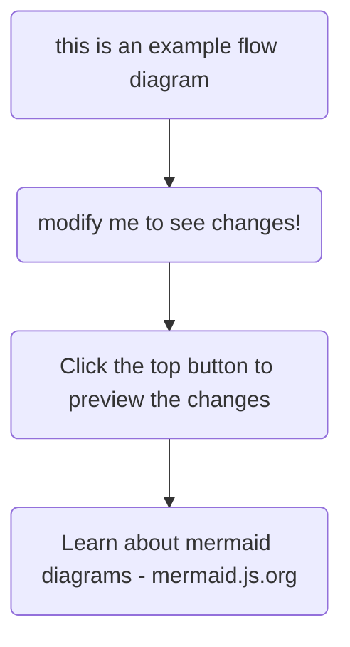
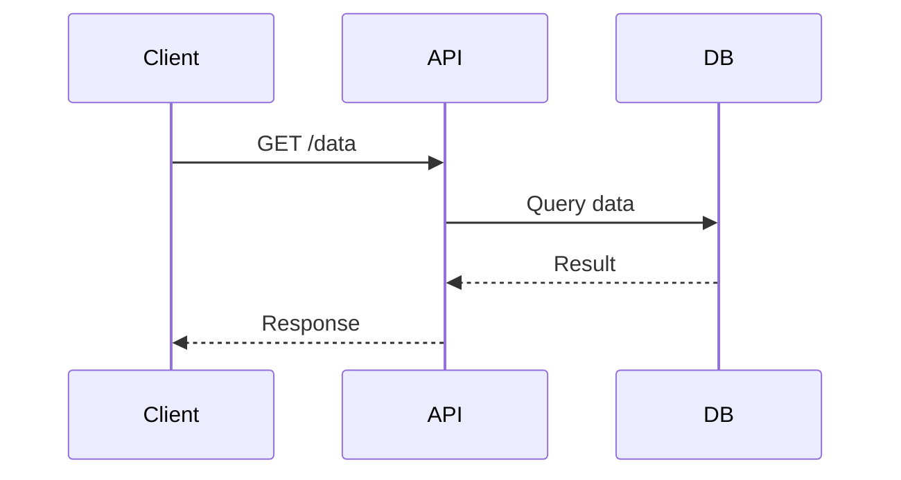
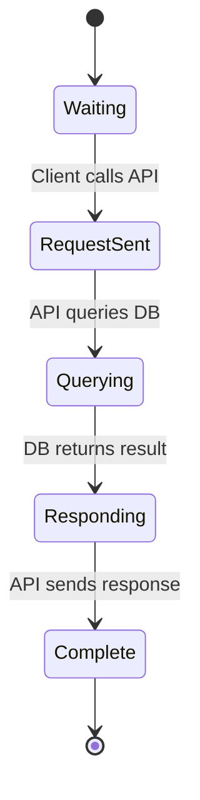
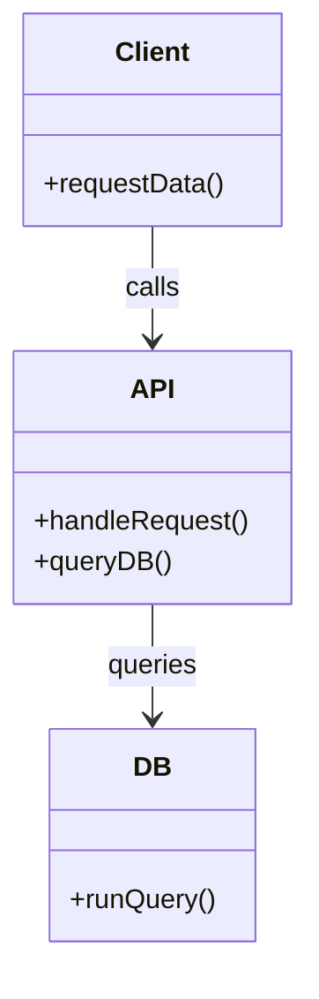
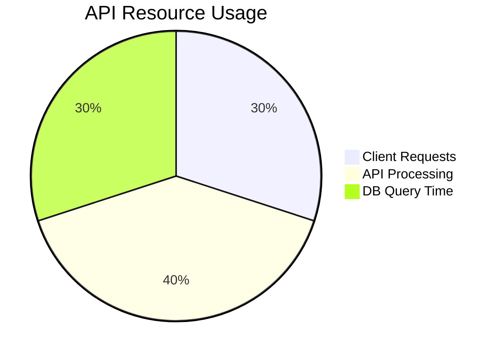

TinaDocs supports [Mermaid.js](https://mermaid.js.org/) to let you define and render diagrams directly inside Markdown content. This enables you to add flowcharts, sequence diagrams, Gantt charts, and more—without ever leaving your content file.

While the diagram appears inside code\_block UI blocks in the editor, it is actually stored in a distinct node with the `type: mermaid`

<Callout
  body={<>
    Mermaid Rendering is **client-side** only, so server-side previews wont show diagrams
  </>}
  variant="warning"
/>

You can also preview all mermaid diagrams inside the rich-text editor:

## Flowcharts

## Sequence Diagrams

## State Diagram

## Class Diagram

## Gaant Chart

```mermaid
gantt
  title API Data Flow
  dateFormat  HH:mm
  axisFormat  %H:%M

  section Request
  Client Sends Request  :a1, 09:00, 1m
  API Receives Request  :a2, after a1, 1m

  section Processing
  API Queries DB        :a3, after a2, 2m
  DB Returns Result     :a4, after a3, 1m
  API Responds          :a5, after a4, 1m

```

## Pie Chart

