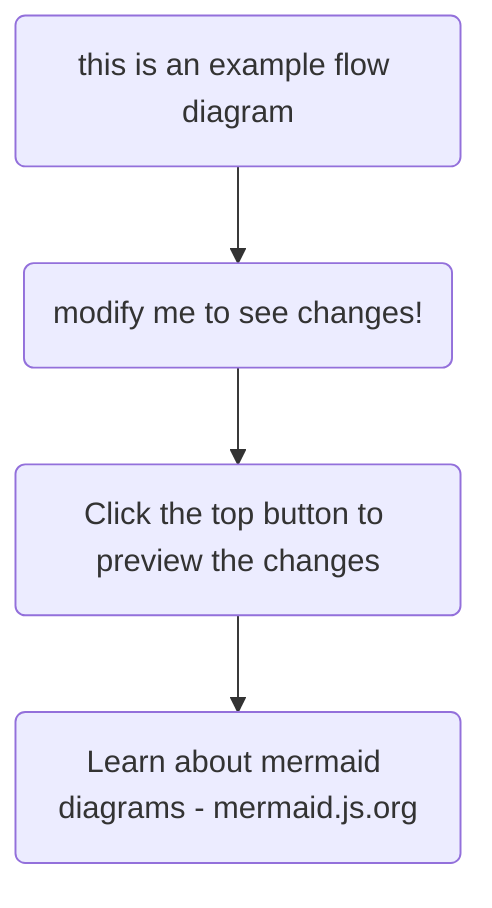

This page can be used as a reference to see what's possible with TinaCMS, and also what components come built in with TinaDocs.

All components are built with React and Tailwind – pull down the repo to add additional components or modify existing component behaviour.

Here is an example of a link, [organisation settings](https://google.com).

## Display Components

### Card Grids

<cardGrid
  cards={[
    {
      title: "Modular Cards",
      description:
        "Each card can be set to a link, or used to display information.",
      link: "https://google.com",
      linkText: "Read more..."
    },
    { title: "Grid Layout", description: "Classic index page material. 🗄️" },
    {
      title: "CTA by Use Case...",
      description:
        "Have one card for tutorials, one card for a main feature, ... etc"
    },
    {
      title: "...or Just General Info",
      description: "Organise your thoughts. 🧠"
    }
  ]}
/>

### Scroll-Based Showcase

<scrollShowcase
  showcaseItems={[
    {
      title: "Your Website",
      image: "/SCR-20250408-oknp.png",
      content:
        "With TinaCMS, the developer hosts the site where they like, using whichever framework they choose\n",
      useAsSubsection: false
    },
    {
      title: "TinaCloud",
      image: "/SCR-20250407-kyks.png",
      content:
        "Out of the box, we provide an easy-to-use hosted version of the backend, called TinaCloud\n",
      useAsSubsection: false
    },
    {
      title: "Git-Backed Content",
      image: "/img/rico-replacement.jpg",
      content:
        "All your content gets backed by git into JSON, Markdown or MDX Files\n",
      useAsSubsection: false
    }
  ]}
/>

### Accordians

Choose between full-width accordions that are stand-alone

<accordion
  heading="Full width accordian here... click on me"
  docText={<>
    Here's our pet llamas, arent they so cute?
  </>}
  image="/img/rico-replacement.jpg"
  fullWidth={true}
/>

<accordion
  heading="Full width accordian here... click on me"
  docText={<>
    Here's our pet llamas, arent they so cute?
  </>}
  image="/img/rico-replacement.jpg"
  fullWidth={true}
/>

or blocked accordions that are all connected

<accordionBlock
  accordionItems={[
    {
      heading: "Full width accordian here... click on me",
      docText: "Default Text. Edit me!\n",
      image: "/img/rico-replacement.jpg"
    },
    {
      heading: "Full width accordian here... click on me",
      docText: "Default Text. Edit me!\n",
      image: "/img/rico-replacement.jpg"
    }
  ]}
  fullWidth={true}
/>

The same options apply for accordions that are not full-width

<accordion
  heading="Stand-alone"
  docText={<>
    This content doesn't have any images
  </>}
  image=""
  fullWidth={false}
/>

or

<accordionBlock
  accordionItems={[
    {
      heading: "A set of blocked",
      docText: "Default Text. Edit me!\n",
      image: "/img/rico-replacement.jpg"
    },
    {
      heading: "Accordion items",
      docText: "Default Text. Edit me!\n",
      image: "/img/rico-replacement.jpg"
    }
  ]}
/>

## Technical Components

### Type Reference

<apiReference
  property={[
      {
        groupName: "",
        name: "objectId",
        description: "This determines how the object will be accessed by Tina.\n",
        type: "long",
        required: true
      },
      { groupName: "Options", name: "format", type: "string", default: "table" },
      {
        groupName: "Options",
        name: "enableExperimental",
        type: "boolean",
        default: "false"
      },
      { name: "title", type: "string", default: "API Reference" },
      { name: "description", type: "string", default: "API Reference" },
      {
        name: "fluxCapacitor",
        description: "Powers the DeLorian\n",
        type: "Machine",
        experimental: true
      }
    ]}
/>

### Mermaid Diagrams



## Markdown Basics

### YouTube Embed

<youtube embedSrc="https://www.youtube.com/embed/CsCQS7HIBv0?si=os9ona92O2VMOl-V" caption="Seth goes over the basics of using Tina" minutes="2" />

### A Few Callouts

<Callout
  body={<>
    This is a warning
  </>}
/>

<Callout
  body={<>
    For good examples...
  </>}
  variant="success"
/>

<Callout
  body={<>
    ... and for bad! 😱
  </>}
  variant="error"
/>

<Callout
  body={<>
    We can even write notes about using `https://api.example.com/v1`
  </>}
  variant="api"
/>

### Tables

| Heading Labels... | ...Go Here   |
| ----------------- | ------------ |
| Put your...       | ...data here |

### Code Blocks

#### Inline Code

We can enclose any text in back ticks to indicate inline code

#### Singular Code Blocks

Marked by surrounding code with three back ticks

```javascript
export const myCodeBlockFunction() => {
  console.log('Powered by Shiki');
}   
```

We have the power to highlight diffs, or just certain lines in our code

```javascript
console.log('This is a negative diff') // [!code --]
console.log('This is a positive diff') // [!code ++]
console.log('This is a highlighted block') // [!code highlight]
console.log('This is generic code')
```

We must be careful when running the focused code with highlighted code!

```javascript
console.log('Junk Code');
console.log('Focused Code'); // [!code focus]
console.log('More hidden code');
```

#### Tabbed Code Blocks

<queryResponseTabs
  response="const myExampleFunction(){
  console.log(&#x22;from myExampleFunction&#x22;)
  return (&#x22;MyLlama&#x22;)
  }"
  query="We can use CodeBlocks to guide users
  or to just show off our cool code!"
/>

## Steps

Want to show users how to do something:

<steps
  stepBlock={[
    {
      description:
        "Lorem ipsum dolor sit amet, consectetur adipiscing elit, sed do eiusmod tempor incididunt ut labore et dolore magna aliqua. Ut enim ad minim veniam, quis nostrud exercitation ullamco laboris nisi ut aliquip ex ea commodo consequat."
    },
    {
      description:
        "Lorem ipsum dolor sit amet, consectetur adipiscing elit, sed do eiusmod tempor incididunt ut labore et dolore magna aliqua. Ut enim ad minim veniam, quis nostrud exercitation ullamco laboris nisi ut aliquip ex ea commodo consequat."
    },
    {
      description:
        "Lorem ipsum dolor sit amet, consectetur adipiscing elit, sed do eiusmod tempor incididunt ut labore et dolore magna aliqua. Ut enim ad minim veniam, quis nostrud exercitation ullamco laboris nisi ut aliquip ex ea commodo consequat."
    }
  ]}
/>
