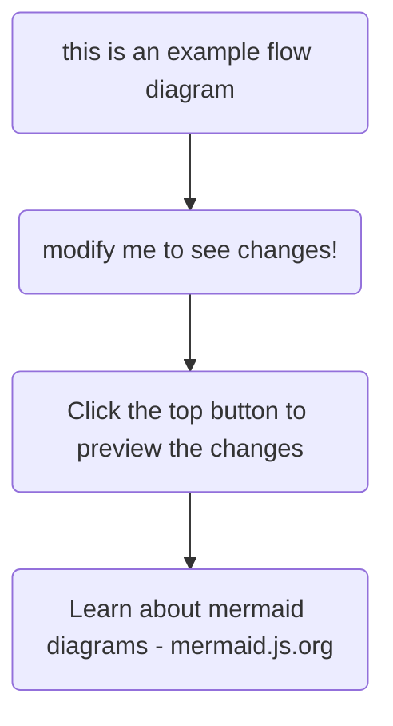

This page can be used as a reference to see what's possible with TinaCMS, and also what components come built in with TinaDocs.

All components are built with React and Tailwind – pull down the repo to add additional components or modify existing component behaviour.

## Display Components

### Scroll Responsive Highlights

<scrollShowcase
  showcaseItems={[
    {
      title: "Highlights on Scroll",
      image: "",
      content:
        "This component highlights based on your page position, with a clean list view for mobile.\n",
      useAsSubsection: false
    },
    {
      title: "Leveraging MDX",
      image: "",
      content:
        "MDX is a markdown format which includes injection of custom components... Think JSX/TSX for markdown!\n",
      useAsSubsection: false
    },
    {
      title: "... and React",
      image: "",
      content: "Define your custom components in your code with React.\n",
      useAsSubsection: true
    },
    {
      title: "Landing-page-perfect",
      image: "",
      content: "This one works great for the first page of your documentation.\n",
      useAsSubsection: false
    }
  ]}
/>

### Card Grids

<cardGrid
  cards={[
    {
      title: "Modular Cards",
      description:
        "Each card can be set to a link, or used to display information.",
      link: "",
      linkText: ""
    },
    { title: "Grid Layout", description: "Classic index page material. 🗄️" },
    {
      title: "CTA by Use Case...",
      description:
        "Have one card for tutorials, one card for a main feature, ... etc"
    },
    {
      title: "...or Just General Info",
      description: "Organise your thoughts. 🧠"
    }
  ]}
/>

### Basic Accordion

<accordion />

### API Reference

## Technical Components

### Our "Recipe" - Code Accordion

<recipe />

### API Reference

<apiReference />

### Query-Response

<queryResponseTabs />

### Mermaid Diagrams



### Code Blocks

```javascript
We use Prism under the hood
  for 
language specific code highlights 🖍️
```

## Markdown Basics

### YouTube Embed

<youtube />

### A Few Callouts

<WarningCallout />

### BlockQuotes

> Less opinionated than the callouts 🏴.

### Images

### Lists

1. Numbered lists...
2. ...\\

or

* ...dot points to capture key information

### Tables

| Heading Labels... | ...Go Here   |
| ----------------- | ------------ |
| Put your...       | ...data here |
