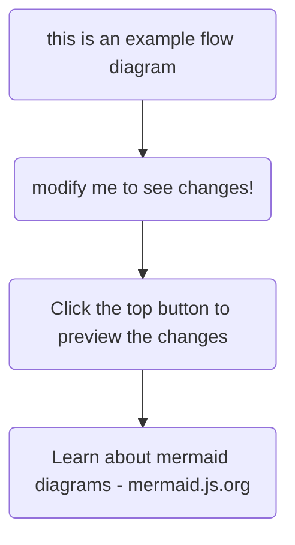

This page can be used as a reference to see what's possible with TinaCMS, and also what components come built in with TinaDocs.

All components are built with React and Tailwind – pull down the repo to add additional components or modify existing component behaviour.

## Display Components

### Card Grids

<cardGrid
  cards={[
    {
      title: "Modular Cards",
      description:
        "Each card can be set to a link, or used to display information.",
      link: "https://google.com",
      linkText: "Read more..."
    },
    { title: "Grid Layout", description: "Classic index page material. 🗄️" },
    {
      title: "CTA by Use Case...",
      description:
        "Have one card for tutorials, one card for a main feature, ... etc"
    },
    {
      title: "...or Just General Info",
      description: "Organise your thoughts. 🧠"
    }
  ]}
/>

## Technical Components

### API Reference

<apiReference
  property={[
    {
      groupName: "",
      name: "objectId",
      description: "This determines how the object will be accessed by Tina.\n",
      type: "long",
      required: true
    },
    { groupName: "Options", name: "format", type: "string", default: "table" },
    {
      groupName: "Options",
      name: "enableExperimental",
      type: "boolean",
      default: "false"
    },
    { name: "title", type: "string", default: "API Reference" },
    { name: "description", type: "string", default: "API Reference" },
    {
      name: "fluxCapacitor",
      description: "Powers the DeLorian\n",
      type: "Machine",
      experimental: true
    }
  ]}
/>

### Mermaid Diagrams



## Markdown Basics

### YouTube Embed

<youtube embedSrc="https://www.youtube.com/embed/CsCQS7HIBv0?si=os9ona92O2VMOl-V" caption="Seth goes over the basics of using Tina" minutes="2" />

### A Few Callouts

<Callout
  body={<>
    This is a warning
  </>}
/>

<Callout
  body={<>
    For good examples...
  </>}
  variant="success"
/>

<Callout
  body={<>
    ... and for bad! 😱
  </>}
  variant="error"
/>

### Tables

| Heading Labels... | ...Go Here   |
| ----------------- | ------------ |
| Put your...       | ...data here |

### Accordians

<accordion
  heading="Full width accordian here... click on me"
  docText={<>
    Here's our pet llamas, arent they so cute?
  </>}
  image="/img/rico-replacement.jpg"
  fullWidth={true}
/>

<accordion
  heading="Not full-width"
  docText={<>
    This content doesn't have any images
  </>}
  image=""
  fullWidth={false}
/>

### Code Blocks

#### Singular Code Blocks

Marked by surrounding code with three back ticks

```javascript
Generic Code Block Here {
  Powered by PrismJS
}
```

#### Tabbed Code Blocks
<queryResponseTabs
  response="const myExampleFunction(){
    console.log(&#x22;from myExampleFunction&#x22;)
    return (&#x22;MyLlama&#x22;)
  }"
  query="We can use CodeBlocks to guide users
  or to just show off our cool code!"
/>
